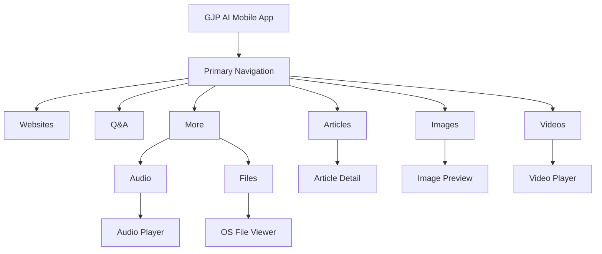

# Information Architecture

## Recommended Navigation

Use bottom tabs for the most common sections:

- Websites
- Q&A
- Articles
- Images
- Videos

Place Audio, Files, language/theme settings, app information, and support links in a More screen unless product testing shows they are frequently used.
