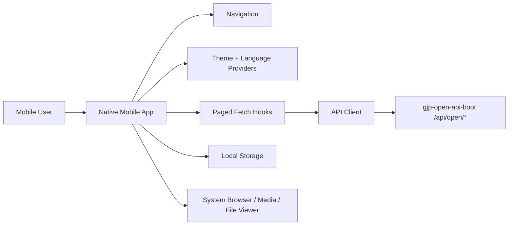

# Runtime Architecture

## Module Rules

- App shell, navigation, and providers live in `src/app`.
- Feature screens live in `src/features/{feature}`.
- Reusable UI, API, hooks, theme, i18n, storage, and utilities live in `src/shared`.
- Feature modules may import from `shared`; `shared` must not import from feature folders.
